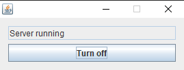
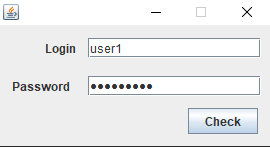
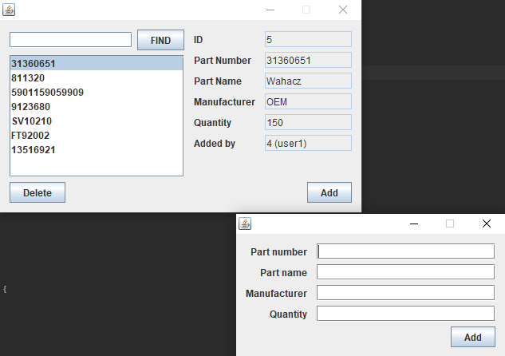

# java-RMI-with-database
This is a basic implementation of RMI in java, with Forms and database access. Made just to pass a subject.
It is an application where warehouse workers can add and remove car parts.

## Screenshots

### Server-side

### Client-side

